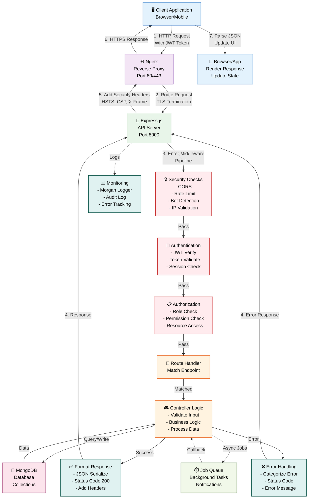

# API Documentation

## API Request/Response Flow Diagram



---

## Base URL

**Development:** `http://localhost:8000/api/v1`
**Production:** `https://api.example.com/api/v1`

## Authentication

All endpoints (except `/auth/register` and `/auth/login`) require a valid JWT token in the `Authorization` header.

```
Authorization: Bearer <jwt_token>
```

---

## Authentication Endpoints

### Register New User

```
POST /auth/register
Content-Type: application/json

{
  "email": "user@example.com",
  "password": "SecurePassword123!",
  "firstName": "John",
  "lastName": "Doe"
}

Response (201):
{
  "status": 201,
  "message": "Registration successful. Check email for verification.",
  "user": {
    "id": "user_abc123",
    "email": "user@example.com",
    "verified": false
  }
}
```

### Email Verification

```
POST /auth/verify-email
Content-Type: application/json

{
  "email": "user@example.com",
  "otp": "123456"
}

Response (200):
{
  "status": 200,
  "message": "Email verified successfully",
  "user": {
    "id": "user_abc123",
    "verified": true
  }
}
```

### Login

```
POST /auth/login
Content-Type: application/json

{
  "email": "user@example.com",
  "password": "SecurePassword123!"
}

Response (200):
{
  "status": 200,
  "message": "Login successful",
  "tokens": {
    "accessToken": "eyJhbGc...",
    "refreshToken": "eyJhbGc...",
    "expiresIn": 3600
  },
  "user": {
    "id": "user_abc123",
    "email": "user@example.com",
    "role": "user"
  }
}

Response (403) - MFA Required:
{
  "status": 403,
  "code": "MFA_REQUIRED",
  "message": "Additional verification required",
  "challengeId": "challenge_xyz789",
  "methods": ["totp", "email_otp"]
}
```

### Refresh Token

```
POST /auth/refresh
Content-Type: application/json

{
  "refreshToken": "eyJhbGc..."
}

Response (200):
{
  "status": 200,
  "tokens": {
    "accessToken": "eyJhbGc...",
    "expiresIn": 3600
  }
}
```

### Logout

```
POST /auth/logout
Authorization: Bearer <token>

Response (200):
{
  "status": 200,
  "message": "Logged out successfully"
}
```

### Forgot Password

```
POST /auth/forgot-password
Content-Type: application/json

{
  "email": "user@example.com"
}

Response (200):
{
  "status": 200,
  "message": "Reset link sent to email"
}
```

### Reset Password

```
POST /auth/reset-password
Content-Type: application/json

{
  "token": "reset_token_xyz",
  "newPassword": "NewPassword123!"
}

Response (200):
{
  "status": 200,
  "message": "Password reset successfully"
}
```

---

## User Endpoints

### Get User Profile

```
GET /users/profile
Authorization: Bearer <token>

Response (200):
{
  "status": 200,
  "user": {
    "id": "user_abc123",
    "email": "user@example.com",
    "firstName": "John",
    "lastName": "Doe",
    "role": "user",
    "verified": true,
    "mfaEnabled": true,
    "createdAt": "2026-01-15T10:30:00Z"
  }
}
```

### Update User Profile

```
PUT /users/profile
Authorization: Bearer <token>
Content-Type: application/json

{
  "firstName": "John",
  "lastName": "Smith",
  "phone": "+1234567890"
}

Response (200):
{
  "status": 200,
  "message": "Profile updated successfully",
  "user": {
    "id": "user_abc123",
    "firstName": "John",
    "lastName": "Smith"
  }
}
```

### Get User Subscriptions

```
GET /users/subscriptions
Authorization: Bearer <token>

Response (200):
{
  "status": 200,
  "subscriptions": [
    {
      "id": "sub_xyz789",
      "plan": "premium",
      "status": "active",
      "expiresAt": "2026-06-15T10:30:00Z",
      "renewalDate": "2026-06-15"
    }
  ]
}
```

---

## Admin Endpoints

### List All Users

```
GET /admin/users?page=1&limit=20&role=user
Authorization: Bearer <admin_token>

Response (200):
{
  "status": 200,
  "data": {
    "users": [...],
    "pagination": {
      "page": 1,
      "limit": 20,
      "total": 150,
      "pages": 8
    }
  }
}
```

### Get User Details

```
GET /admin/users/{userId}
Authorization: Bearer <admin_token>

Response (200):
{
  "status": 200,
  "user": {
    "id": "user_abc123",
    "email": "user@example.com",
    "role": "user",
    "lastLogin": "2026-05-08T10:30:00Z",
    "loginAttempts": 0,
    "mfaEnabled": true,
    "subscriptions": [...]
  }
}
```

### Update User

```
PUT /admin/users/{userId}
Authorization: Bearer <admin_token>
Content-Type: application/json

{
  "role": "premium",
  "status": "active"
}

Response (200):
{
  "status": 200,
  "message": "User updated successfully"
}
```

### Deactivate User

```
DELETE /admin/users/{userId}
Authorization: Bearer <admin_token>

Response (200):
{
  "status": 200,
  "message": "User deactivated successfully"
}
```

---

## Session Endpoints

### Get Active Sessions

```
GET /sessions/active
Authorization: Bearer <token>

Response (200):
{
  "status": 200,
  "sessions": [
    {
      "id": "session_abc123",
      "device": "Chrome on Windows",
      "ipAddress": "192.168.1.100",
      "lastActivity": "2026-05-08T10:30:00Z",
      "isCurrent": true
    }
  ]
}
```

### Terminate Session

```
DELETE /sessions/{sessionId}
Authorization: Bearer <token>

Response (200):
{
  "status": 200,
  "message": "Session terminated successfully"
}
```

---

## Security Endpoints

### Setup Two-Factor Authentication

```
POST /security/2fa/setup
Authorization: Bearer <token>

Response (200):
{
  "status": 200,
  "secret": "JBSWY3DPEBLW64TMMQ...",
  "qrCode": "data:image/png;base64,...",
  "backupCodes": ["CODE1", "CODE2", ...]
}
```

### Verify TOTP

```
POST /security/2fa/verify
Authorization: Bearer <token>
Content-Type: application/json

{
  "code": "123456"
}

Response (200):
{
  "status": 200,
  "message": "2FA enabled successfully"
}
```

### Get Trust Score

```
GET /security/trust-score
Authorization: Bearer <token>

Response (200):
{
  "status": 200,
  "trustScore": 85,
  "factors": {
    "deviceReputation": 90,
    "behavioralScore": 80,
    "ipReputation": 85,
    "geographicConsistency": 75
  },
  "requiresMFA": false
}
```

---

## Error Response Examples

### Validation Error (400)

```json
{
  "status": 400,
  "code": "VALIDATION_ERROR",
  "message": "Validation failed",
  "details": {
    "email": "Invalid email format",
    "password": "Password must be at least 12 characters"
  },
  "request_id": "req_xyz789"
}
```

### Unauthorized (401)

```json
{
  "status": 401,
  "code": "UNAUTHORIZED",
  "message": "Authentication required",
  "request_id": "req_xyz789"
}
```

### Forbidden (403)

```json
{
  "status": 403,
  "code": "INSUFFICIENT_PRIVILEGE",
  "message": "You do not have permission to perform this action",
  "request_id": "req_xyz789"
}
```

### Rate Limited (429)

```json
{
  "status": 429,
  "code": "RATE_LIMIT_EXCEEDED",
  "message": "Too many requests. Please try again later.",
  "retryAfter": 3600,
  "request_id": "req_xyz789"
}
```

### Server Error (500)

```json
{
  "status": 500,
  "code": "INTERNAL_SERVER_ERROR",
  "message": "An internal server error occurred",
  "request_id": "req_xyz789"
}
```

---

## Response Headers

All responses include:

```
Content-Type: application/json
X-Request-ID: req_xyz789
X-RateLimit-Limit: 100
X-RateLimit-Remaining: 95
X-RateLimit-Reset: 1620000000
```

---

## Request Headers

Required for all requests:

```
Accept: application/json
Content-Type: application/json
User-Agent: <client-user-agent>
X-CSRF-Token: <csrf-token> (if applicable)
```

---

## WebSocket Events

### Connection

```javascript
io.on('connect', (socket) => {
  console.log('Connected:', socket.id);
});
```

### Real-time Events

```javascript
// Receive events
socket.on('session-timeout-warning', (data) => {
  // User will be logged out in X seconds
});

socket.on('security-alert', (data) => {
  // Unusual activity detected
});

socket.on('notification', (data) => {
  // New notification
});

socket.on('cross-device-logout', (data) => {
  // User logged in from another device
});

// Emit events
socket.emit('acknowledge-alert', { alertId });
```

---

## Pagination

Endpoints supporting pagination use query parameters:

```
GET /admin/users?page=1&limit=20&sort=createdAt&order=desc

page: Current page (default: 1)
limit: Items per page (default: 20, max: 100)
sort: Field to sort by
order: asc or desc
```

Response includes pagination metadata:

```json
{
  "pagination": {
    "page": 1,
    "limit": 20,
    "total": 150,
    "pages": 8,
    "hasNext": true,
    "hasPrev": false
  }
}
```

---

## Rate Limiting

All endpoints are rate-limited based on user role and subscription:

- **Anonymous Users**: 10 requests/minute
- **Free Users**: 60 requests/minute
- **Premium Users**: 300 requests/minute
- **Admin Users**: 1000 requests/minute

Rate limit info returned in response headers:

```
X-RateLimit-Limit: 100
X-RateLimit-Remaining: 95
X-RateLimit-Reset: 1620000000
```

---

## API Versioning

API endpoints are versioned in the URL path:

- Current Version: `v1`
- Deprecation Policy: Minimum 12 months support after v2 release

When a new version is available, `X-API-Version-Available` header is included in responses.

---

See detailed middleware documentation: [Middleware Docs](./MIDDLEWARE.md)
