# Contributing Guidelines

## Development Workflow Diagram

```mermaid
graph TB
    Start[" Start Contributing"]
    
    Start --> Fork["1️⃣ Fork Repository<br/>Click Fork on GitHub<br/>Creates your copy"]
    
    Fork --> Clone["2️⃣ Clone Your Fork<br/>git clone your-fork<br/>Add upstream remote"]
    
    Clone --> Setup["3️⃣ Setup Environment<br/>npm install<br/>Configure .env<br/>Install pre-commit hooks"]
    
    Setup --> Branch["4️⃣ Create Feature Branch<br/>git checkout -b feature/name<br/>Branch naming convention<br/>feature/* or bugfix/*"]
    
    Branch --> Code["5️⃣ Write Code<br/>Follow style guide<br/>ESLint & Prettier<br/>Type safety (TypeScript)"]
    
    Code --> Test["6️⃣ Write Tests<br/>Unit tests<br/>Integration tests<br/>Security tests"]
    
    Test --> Local["7️⃣ Local Testing<br/>npm run dev<br/>npm run test<br/>npm run test:security"]
    
    Local --> Decision1{"Tests Pass?"}
    
    Decision1 -->|No| Code
    Decision1 -->|Yes| Lint["8️⃣ Run Linter<br/>npm run lint<br/>npm run format<br/>Fix warnings"]
    
    Lint --> Decision2{"No Issues?"}
    
    Decision2 -->|Issues| Code
    Decision2 -->|Clean| Commit["9️⃣ Commit Changes<br/>git add .<br/>Conventional commits<br/>feat: add feature<br/>fix: resolve bug<br/>docs: update readme"]
    
    Commit --> Push["🔟 Push to Fork<br/>git push origin feature/name<br/>Updates your GitHub fork"]
    
    Push --> PR["1️⃣1️⃣ Create Pull Request<br/>Click Create PR<br/>Fill PR template<br/>Link to issue<br/>Describe changes"]
    
    PR --> Review["1️⃣2️⃣ Code Review<br/>Maintainers review<br/>Feedback & discussion<br/>Request changes if needed"]
    
    Review --> Decision3{"Approved?"}
    
    Decision3 -->|Changes Requested| Update["1️⃣3️⃣ Update PR<br/>Make requested changes<br/>git push (auto-update PR)<br/>Respond to comments"]
    
    Update --> Review
    
    Decision3 -->|Approved| Merge["1️⃣4️⃣ Merge to Main<br/>Maintainer merges PR<br/>CI/CD runs<br/>Deploys to staging"]
    
    Merge --> Cleanup["1️⃣5️⃣ Cleanup<br/>Delete feature branch<br/>Sync fork with upstream<br/>git fetch upstream<br/>git rebase upstream/main"]
    
    Cleanup --> Success["✅ Contribution Complete<br/>Your code is live!<br/>Thank you!"]
    
    %% CI/CD checks
    Commit -.->|Trigger| CI["🤖 CI/CD Pipeline<br/>Run Tests<br/>Lint Check<br/>Security Scan<br/>Build Check"]
    CI -.->|Results| PR
    
    %% Parallel activities
    Local -.->|Optional| Docs["📚 Update Docs<br/>README changes<br/>API docs<br/>Comments"]
    Docs -.->|Include| Commit
    
    %% Styling
    classDef setup fill:#e3f2fd,stroke:#1565c0,color:#000
    classDef dev fill:#e8f5e9,stroke:#1b5e20,color:#000
    classDef testing fill:#fff3e0,stroke:#e65100,color:#000
    classDef submission fill:#f3e5f5,stroke:#6a1b9a,color:#000
    classDef review fill:#ffebee,stroke:#c62828,color:#000
    classDef decision fill:#fffde7,stroke:#f57f17,color:#000
    classDef complete fill:#e0f2f1,stroke:#004d40,color:#000
    classDef automation fill:#fce4ec,stroke:#880e4f,color:#000

    class Start,Fork,Clone,Setup setup
    class Branch,Code dev
    class Test,Local,Lint testing
    class Commit,Push,PR submission
    class Review,Update,Merge,Cleanup review
    class Decision1,Decision2,Decision3 decision
    class Success complete
    class CI,Docs automation
```



---

## Welcome to the Assessment Platform Project

Thank you for your interest in contributing! This guide will help you understand how to contribute effectively to the project.

---

## Code of Conduct

We are committed to providing a welcoming and inclusive environment for all contributors. Please:

- Be respectful and courteous
- Report issues privately before public disclosure
- Focus on the code, not the person
- Help others learn and grow

---

## Getting Started

### 1. Fork & Clone

```bash
# Fork repository on GitHub
# Clone your fork
git clone https://github.com/YOUR_USERNAME/expense-tracker.git
cd expense-tracker

# Add upstream remote
git remote add upstream https://github.com/ORIGINAL_OWNER/expense-tracker.git
```

### 2. Create Feature Branch

```bash
# Update main branch
git fetch upstream
git checkout main
git rebase upstream/main

# Create feature branch
git checkout -b feature/your-feature-name

# Branch naming conventions:
# feature/add-user-dashboard
# bugfix/fix-login-issue
# docs/update-readme
# chore/update-dependencies
```

### 3. Development Environment

```bash
# Install dependencies
npm install

# Configure environment variables
cp .env.example .env
# Edit .env with your settings

# Start development server
npm run dev

# Run tests
npm run test:security
```

---

## Development Workflow

### Code Style

**JavaScript/TypeScript:**
- Use ESLint config: `.eslintrc.json`
- Use Prettier for formatting
- 2-space indentation
- Semicolons required
- PascalCase for classes/components
- camelCase for functions/variables
- UPPER_SNAKE_CASE for constants

```bash
# Format code
npm run format

# Lint code
npm run lint
```

**Commit Message Format:**
```
type(scope): subject

body

footer
```

Examples:
```
feat(auth): add TOTP support

Add Time-based One-Time Password (TOTP) authentication using speakeasy library.
Includes QR code generation and backup codes.

Closes #123
```

```
fix(security): prevent IP spoofing

Add validation for X-Forwarded-For header to detect spoofing attempts.
Implement geolocation verification before accepting proxied IPs.

Fixes #456
```

**Types:**
- `feat`: New feature
- `fix`: Bug fix
- `docs`: Documentation
- `style`: Code style changes
- `refactor`: Code refactoring
- `test`: Test additions/modifications
- `chore`: Build/dependency changes
- `perf`: Performance improvements

### Making Changes

**Backend Changes:**

```javascript
// Bad: Missing error handling
const user = await User.findById(id);
return res.json(user);

// Good: Proper error handling and validation
try {
  const user = await User.findById(id);
  if (!user) {
    return res.status(404).json({
      code: 'USER_NOT_FOUND',
      message: 'User not found'
    });
  }
  return res.json(user);
} catch (error) {
  logger.error('User fetch failed', { id, error });
  throw error;
}
```

**Frontend Changes:**

```typescript
// Use TypeScript for type safety
interface UserProfile {
  id: string;
  email: string;
  firstName: string;
  lastName: string;
}

// Proper error boundaries
try {
  const profile = await fetchProfile(userId);
} catch (error) {
  handleError(error);
}
```

### Testing

**Write Tests For:**
- New features (unit tests)
- Bug fixes (regression tests)
- Security-related changes
- API endpoints
- Middleware

**Test Commands:**
```bash
# Run all tests
npm run test:security

# Run specific test file
npm test -- backend/tests/auth.test.js

# Watch mode
npm test -- --watch
```

**Test Structure:**
```javascript
describe('AuthService', () => {
  describe('login', () => {
    it('should authenticate user with valid credentials', () => {
      // Test implementation
    });

    it('should throw error with invalid credentials', () => {
      // Test implementation
    });
  });
});
```

---

## Documentation

### Update Documentation When:

- Adding new features
- Changing existing behavior
- Adding new endpoints
- Modifying security procedures
- Updating configuration
- Changing deployment process

### Documentation Files:

- [SYSTEM_ARCHITECTURE.md](./SYSTEM_ARCHITECTURE.md) - System design
- [API_DOCUMENTATION.md](./API_DOCUMENTATION.md) - API reference
- [ERROR_HANDLING.md](./ERROR_HANDLING.md) - Error codes and handling
- [SECURITY.md](./SECURITY.md) - Security architecture
- [MIDDLEWARE.md](./MIDDLEWARE.md) - Middleware reference
- [DATABASE.md](./DATABASE.md) - Database schema
- [DEPLOYMENT.md](./DEPLOYMENT.md) - Deployment procedures

### Documentation Format:

```markdown
# Section Title

## Subsection

Brief description of the section.

### Code Example

```javascript
// Code here
```

### Key Points

- Point 1
- Point 2
- Point 3

## See Also

- [Related Doc](./path)
```

---

## Pull Request Process

### 1. Before Creating PR

```bash
# Ensure your branch is up to date
git fetch upstream
git rebase upstream/main

# Run tests locally
npm run test:security

# Run linter
npm run lint

# Commit changes
git add .
git commit -m "feat(scope): description"

# Push to your fork
git push origin feature/your-feature-name
```

### 2. Create Pull Request

**PR Title Format:**
```
[TYPE] Brief description of changes
```

Examples:
```
[FEATURE] Add TOTP authentication support
[BUGFIX] Fix login rate limiting bug
[DOCS] Update API documentation
```

**PR Description Template:**
```markdown
## Description

Brief description of what this PR does.

## Related Issue

Closes #123

## Changes Made

- Change 1
- Change 2
- Change 3

## Type of Change

- [ ] Bug fix
- [ ] New feature
- [ ] Documentation update
- [ ] Performance improvement
- [ ] Breaking change

## How Has This Been Tested?

Describe the tests you added or modified.

## Checklist

- [ ] Code follows style guidelines
- [ ] Tests added/updated
- [ ] Documentation updated
- [ ] No new warnings generated
- [ ] Change generates no breaking changes
```

### 3. Code Review Process

**What Reviewers Check:**
- Code quality and style
- Test coverage
- Security implications
- Performance impact
- Documentation completeness
- Breaking changes

**Request Review:**
```
1. Push your branch
2. Create PR
3. Wait for CI to pass
4. Request review from maintainers
5. Respond to feedback
6. Iterate until approved
```

**Responding to Feedback:**
```bash
# Make requested changes
git add .
git commit -m "Address review feedback"
git push origin feature/your-feature-name

# Click "Request Review" again in PR
```

### 4. Merge

Once approved:

```bash
# Ensure branch is up to date
git fetch upstream
git rebase upstream/main
git push origin feature/your-feature-name --force-with-lease

# Maintainer merges PR
# Your branch can be deleted
```

---

## Security Considerations

### When Contributing Security-Related Code

1. **Never commit secrets:**
   ```bash
   # Use .env files (never committed)
   # Use environment variables in production
   ```

2. **Validate and sanitize input:**
   ```javascript
   // Always validate user input
   const validated = schema.parse(userInput);
   ```

3. **Use secure defaults:**
   ```javascript
   // Passwords hashed with bcryptjs
   // JWT tokens verified
   // HTTPS enforced
   ```

4. **Report vulnerabilities responsibly:**
   - Email security team privately
   - Don't create public issues for security vulnerabilities
   - Allow time for patch before disclosure

5. **Follow OWASP guidelines:**
   - Prevent injection attacks
   - Avoid cross-site scripting (XSS)
   - Implement proper authentication
   - Enforce access control
   - Use encryption for data in transit and at rest

---

## Performance Guidelines

### When Optimizing

1. **Profile first:**
   ```bash
   # Measure before optimizing
   npm run benchmark
   ```

2. **Measure improvements:**
   ```
   Before: 500ms
   After: 200ms
   Improvement: 60%
   ```

3. **Consider trade-offs:**
   - Readability vs. Performance
   - Memory vs. Speed
   - Complexity vs. Benefits

4. **Database queries:**
   ```javascript
   // Use indexes for frequently searched fields
   // Use .lean() for read-only queries
   // Paginate large result sets
   ```

5. **Frontend:**
   ```
   - Lazy load images
   - Code splitting for bundles
   - Minimize re-renders
   - Use memoization for expensive computations
   ```

---

## Troubleshooting

### Common Issues

**Issue:** Tests failing locally but passing in CI
```
Solution: Clear node_modules and reinstall
npm ci
npm run test:security
```

**Issue:** Linting errors
```
Solution: Run formatter
npm run format
npm run lint -- --fix
```

**Issue:** Database connection issues
```
Solution: Check .env configuration
Verify MongoDB is running
Check connection string
```

**Issue:** Port already in use
```
Solution: Use different port or kill existing process
lsof -i :8000
kill -9 <PID>
```

---

## Resources

- [Project README](../README.md)
- [Backend Setup](../backend/README.md)
- [Frontend Setup](../frontend/README.md)
- [Issue Tracker](https://github.com/project/issues)
- [Discussions](https://github.com/project/discussions)

---

## Questions?

- Check existing issues and discussions
- Review documentation thoroughly
- Ask in GitHub Discussions
- Contact maintainers

---

## Recognition

Contributors will be recognized in:
- CONTRIBUTORS.md file
- Release notes
- GitHub contributor statistics

Thank you for contributing!
