# System Architecture

## Overview

The Online Assessment and Test Management Platform follows a modern, layered architecture pattern with clear separation of concerns. The system is designed for scalability, security, and maintainability.

---

## Architecture Diagram (Mermaid)

```mermaid
graph TB
    subgraph Client["🖥️ Client Layer - React Application"]
        React["React 18+ with TypeScript<br/>(Port 5173)"]
        UI["Components<br/>Pages<br/>Hooks"]
        State["State Management<br/>Context API<br/>Custom Hooks"]
        HTTP_Client["Axios HTTP Client"]
        WS_Client["Socket.IO Client<br/>Real-time Events"]
    end

    subgraph Network["🌐 Network & Proxy Layer"]
        Nginx["Nginx 1.27 Alpine<br/>Reverse Proxy & Load Balancer<br/>(Port 80/443)"]
        TLS["TLS/SSL Termination<br/>Certificate Management"]
        Router["Request Routing<br/>WebSocket Upgrade<br/>Response Compression"]
    end

    subgraph API["📡 API Layer - Express.js"]
        HTTPServer["Express.js HTTP Server<br/>(Port 8000)"]
        WS["Socket.IO<br/>Real-time Channel"]
        
        subgraph Routes["API Routes & Endpoints"]
            Auth["/api/auth<br/>Authentication"]
            Users["/api/users<br/>User Management"]
            Admin["/api/admin<br/>Admin Operations"]
            Sessions["/api/sessions<br/>Session Management"]
            Tokens["/api/tokens<br/>Token Operations"]
            Security["/api/security<br/>Security Settings"]
            Privacy["/api/privacy<br/>Data Privacy"]
            Trust["/api/trust<br/>Zero Trust"]
        end
    end

    subgraph Middleware["🛡️ Middleware Pipeline"]
        M1["CORS & Logging"]
        M2["Rate Limiting"]
        M3["Input Validation"]
        M4["Bot Detection"]
        M5["IP Spoofing Detection"]
        M6["IP Blacklist Check"]
        M7["HMAC Signature"]
        M8["CSRF Protection"]
        M9["JWT Authentication"]
        M10["Zero Trust Score"]
        M11["Replay Attack Prevention"]
        M12["WAF & DDoS Protection"]
        M13["Auto Logout Check"]
        M14["CSP Nonce Injection"]
    end

    subgraph Controllers["🎮 Business Logic Layer"]
        AuthCtrl["authController<br/>Registration<br/>Login<br/>OAuth 2.0"]
        UserCtrl["userController<br/>Profile Management<br/>Preferences"]
        AdminCtrl["adminController<br/>User Management<br/>System Config"]
        TokenCtrl["tokenController<br/>Token Refresh<br/>Token Rotation"]
        SessionCtrl["sessionController<br/>Session Management<br/>Device Tracking"]
        TwoFACtrl["twoFactorController<br/>TOTP<br/>Email OTP"]
        DataCtrl["dataPrivacyController<br/>Data Export<br/>Account Deletion"]
        ZeroCtrl["zeroTrustController<br/>Trust Scoring<br/>Threat Detection"]
    end

    subgraph Security["🔒 Security & Validation"]
        Auth_Sys["Authentication System<br/>JWT Tokens<br/>Refresh Tokens<br/>OAuth 2.0"]
        Trust_Sys["Zero Trust Architecture<br/>Device Score 30%<br/>Behavior 30%<br/>IP 20%<br/>Geographic 20%"]
        Crypto["Encryption & Hashing<br/>bcryptjs<br/>HMAC-SHA256"]
    end

    subgraph Database["💾 Data Layer - MongoDB"]
        Users_DB["Users Collection<br/>Profiles<br/>Credentials"]
        Sessions_DB["AuthSessions<br/>Active Sessions<br/>Device Info"]
        LoginAttempts_DB["LoginAttempts<br/>Failed Attempts"]
        MFA_DB["MFAChallenges<br/>OTP Store"]
        OTP_DB["EmailVerificationOTP<br/>Verification Data"]
        IPBlacklist_DB["IPBlacklist<br/>Blocked IPs"]
        DeviceStore_DB["DeviceStore<br/>Device Fingerprints"]
        BehaviorStore_DB["BehaviorStore<br/>User Behavior"]
        AuditLogs_DB["AuditLogs<br/>Security Events"]
        ApiKeys_DB["ApiKeys<br/>API Credentials"]
    end

    subgraph External["🌍 External Services"]
        Email["Nodemailer<br/>Email Service"]
        OAuth["OAuth 2.0 Providers<br/>Google<br/>GitHub"]
        Web3["Web3 Integration<br/>Smart Contracts"]
    end

    subgraph Monitoring["📊 Monitoring & Logging"]
        Morgan["Morgan HTTP Logger<br/>Request Metrics"]
        AuditLog["Audit Logger<br/>Security Events"]
        ErrorHandler["Error Handler<br/>Exception Tracking"]
        HealthCheck["Health Check Endpoint<br/>System Status"]
    end

    %% Client connections
    React --> UI
    UI --> State
    State --> HTTP_Client
    State --> WS_Client

    %% Network Layer connections
    HTTP_Client --> Nginx
    WS_Client --> Nginx
    Nginx --> TLS
    Nginx --> Router
    Router --> HTTPServer
    Router --> WS

    %% API Layer to Middleware
    HTTPServer --> M1
    M1 --> M2
    M2 --> M3
    M3 --> M4
    M4 --> M5
    M5 --> M6
    M6 --> M7
    M7 --> M8
    M8 --> M9
    M9 --> M10
    M10 --> M11
    M11 --> M12
    M12 --> M13
    M13 --> M14

    %% Routes
    M14 --> Auth
    M14 --> Users
    M14 --> Admin
    M14 --> Sessions
    M14 --> Tokens
    M14 --> Security
    M14 --> Privacy
    M14 --> Trust

    %% Routes to Controllers
    Auth --> AuthCtrl
    Users --> UserCtrl
    Admin --> AdminCtrl
    Sessions --> SessionCtrl
    Tokens --> TokenCtrl
    Security --> TwoFACtrl
    Privacy --> DataCtrl
    Trust --> ZeroCtrl

    %% Security Systems
    AuthCtrl --> Auth_Sys
    UserCtrl --> Auth_Sys
    ZeroCtrl --> Trust_Sys
    AuthCtrl --> Crypto
    ZeroCtrl --> Crypto

    %% Controllers to Database
    AuthCtrl --> Users_DB
    AuthCtrl --> Sessions_DB
    AuthCtrl --> LoginAttempts_DB
    TwoFACtrl --> MFA_DB
    AuthCtrl --> OTP_DB
    UserCtrl --> Users_DB
    AdminCtrl --> Users_DB
    SessionCtrl --> Sessions_DB
    SessionCtrl --> DeviceStore_DB
    ZeroCtrl --> BehaviorStore_DB
    ZeroCtrl --> IPBlacklist_DB

    %% All Controllers to Audit
    AuthCtrl --> AuditLogs_DB
    UserCtrl --> AuditLogs_DB
    AdminCtrl --> AuditLogs_DB
    TokenCtrl --> AuditLogs_DB
    TwoFACtrl --> AuditLogs_DB

    %% External Services
    AuthCtrl --> Email
    AuthCtrl --> OAuth
    Web3 -.->|Optional| AuthCtrl

    %% Monitoring
    HTTPServer --> Morgan
    AuthCtrl --> AuditLog
    AuthCtrl --> ErrorHandler
    HTTPServer --> HealthCheck

    %% WebSocket
    WS --> AuditLog
    WS -.->|Events| Client

    %% Styling
    classDef client fill:#e1f5ff,stroke:#01579b,color:#000
    classDef network fill:#f3e5f5,stroke:#4a148c,color:#000
    classDef api fill:#e8f5e9,stroke:#1b5e20,color:#000
    classDef middleware fill:#fff3e0,stroke:#e65100,color:#000
    classDef controller fill:#fce4ec,stroke:#880e4f,color:#000
    classDef security fill:#f1f8e9,stroke:#33691e,color:#000
    classDef database fill:#ede7f6,stroke:#311b92,color:#000
    classDef external fill:#e0f2f1,stroke:#004d40,color:#000
    classDef monitoring fill:#fbe9e7,stroke:#bf360c,color:#000

    class Client client
    class Network network
    class API,Routes api
    class Middleware middleware
    class Controllers controller
    class Security security
    class Database database
    class External external
    class Monitoring monitoring
```



---

## Layered Architecture

### 1. **Presentation Layer (Frontend)**
- React 18+ with TypeScript
- Vite Build Tool
- Tailwind CSS Styling
- Socket.IO Client for Real-time Updates
- Axios for HTTP Requests

**Key Responsibilities:**
- User Interface Rendering
- Form Handling and Validation
- Client-side State Management
- Real-time Event Handling
- User Session Management

---

### 2. **API Gateway & Reverse Proxy Layer (Nginx)**
- Single Entry Point for All Traffic
- TLS/SSL Termination
- WebSocket Upgrade Handling
- Request Routing to Backend Services
- Load Balancing
- Response Compression
- Static Asset Serving

**Key Responsibilities:**
- Traffic Routing and Distribution
- Protocol Upgrades (HTTP → WebSocket)
- Security Headers Injection
- Request Rate Limiting
- IP Whitelisting/Blocking

---

### 3. **Application Layer (Express.js Backend)**

#### 3.1 Entry Points
- **HTTP/REST API** (Port 8000)
  - Request Handlers
  - Response Formatting
  - Status Code Management

- **WebSocket Real-time Channel** (Port 8000)
  - Bidirectional Communication
  - Event Emission
  - Session Synchronization

#### 3.2 Global Middleware Stack
Executed in sequential order for every request:

```
Request Entry
    |
    v
CORS Middleware
    |
    v
Logging Middleware (Morgan)
    |
    v
Request Parsing (JSON, URL-encoded)
    |
    v
Cookie Parser
    |
    v
Helmet Security Headers
    |
    v
Rate Limiting (express-rate-limit)
    |
    v
Input Validation Middleware
    |
    v
Bot Detection Middleware
    |
    v
IP Spoofing Detection Middleware
    |
    v
IP Blacklist Enforcement
    |
    v
Reverse Proxy Validation
    |
    v
API Version Routing
    |
    v
HMAC Signature Verification
    |
    v
CSRF Token Validation
    |
    v
Authentication Middleware (JWT)
    |
    v
Zero Trust Middleware (Trust Score)
    |
    v
Replay Attack Prevention
    |
    v
Web Application Firewall (WAF)
    |
    v
DDoS Protection
    |
    v
Auto Logout Check
    |
    v
CSP Nonce Injection
    |
    v
Route Handlers / Controllers
    |
    v
Error Middleware (Global Error Handler)
    |
    v
Response Sent
```

#### 3.3 Controllers & Business Logic

**Authentication Controller** (`authController.js`)
- User Registration Flow
- Email Verification (OTP)
- Login with Credentials
- Google OAuth 2.0 Integration
- Password Reset Workflow
- Token Generation

**User Controller** (`userController.js`)
- Profile Retrieval
- Profile Updates
- Preferences Management
- Subscription Information
- Account Settings

**Admin Controller** (`adminController.js`)
- User Management Operations
- Test Management Workflows
- Subscription Administration
- System Configuration
- Audit Trail Queries

**Token Controller** (`tokenController.js`)
- Token Refresh Operations
- Token Rotation
- Token Revocation
- Expiry Validation

**Session Controller** (`sessionController.js`)
- Active Session Listing
- Session Termination
- Device Management
- Cross-device Logout

**Two-Factor Controller** (`twoFactorController.js`)
- TOTP Secret Generation
- QR Code Provisioning
- TOTP Verification
- Backup Codes Management
- OTP Validation

**Data Privacy Controller** (`dataPrivacyController.js`)
- GDPR Data Export
- Account Deletion
- Data Retention Policies
- Privacy Compliance

**Zero Trust Controller** (`zeroTrustController.js`)
- Trust Score Computation
- Device Fingerprinting
- Behavioral Analysis
- Risk Assessment
- Challenge Issuance

#### 3.4 Routes & Endpoints

**Authentication Routes** (`/api/v1/auth`)
- POST `/register` - User Registration
- POST `/login` - Authentication
- POST `/verify-email` - Email Verification
- POST `/refresh` - Token Refresh
- POST `/logout` - Session Termination
- POST `/forgot-password` - Password Reset Initiation
- POST `/reset-password` - Password Reset Completion
- POST `/oauth/google` - Google OAuth Handler

**User Routes** (`/api/v1/users`)
- GET `/profile` - Current User Profile
- PUT `/profile` - Update Profile
- GET `/subscriptions` - User Subscriptions
- GET `/preferences` - User Preferences
- PUT `/preferences` - Update Preferences

**Admin Routes** (`/api/v1/admin`)
- GET `/users` - List All Users
- GET `/users/:id` - User Details
- PUT `/users/:id` - Update User
- DELETE `/users/:id` - Deactivate User
- GET `/tests` - List Tests
- POST `/tests` - Create Test
- GET `/audit-logs` - Audit Trail

**Session Routes** (`/api/v1/sessions`)
- GET `/active` - Active Sessions List
- DELETE `/:id` - Terminate Session
- GET `/devices` - Device Management

**Token Routes** (`/api/v1/tokens`)
- POST `/refresh` - Refresh JWT Token
- POST `/revoke` - Revoke Token

**Security Routes** (`/api/v1/security`)
- POST `/2fa/setup` - TOTP Setup
- POST `/2fa/verify` - Verify TOTP
- GET `/trust-score` - Current Trust Score
- POST `/mfa-challenge` - Challenge Response

---

### 4. **Database Layer**

**MongoDB Collections:**

- **users** - User Accounts & Credentials
- **authSessions** - Active Session Tracking
- **loginAttempts** - Failed Login Records
- **apiKeys** - API Key Management
- **ipBlacklist** - Blocked IP Addresses
- **deviceStore** - Device Fingerprints
- **behaviorStore** - Behavioral Patterns
- **mfaChallenges** - MFA Challenge State
- **emailVerificationOTPs** - Verification Codes
- **auditLogs** - Security Audit Trail
- **tests** - Test/Assessment Content
- **questions** - Test Questions
- **submissions** - User Test Responses
- **subscriptions** - User Subscriptions

---

### 5. **Security Layer**

**Authentication & Authorization:**
- JWT Token-based Authentication
- OAuth 2.0 Social Login
- Multi-Factor Authentication (TOTP + OTP)
- Zero Trust Architecture
- Role-based Access Control (RBAC)

**Data Protection:**
- bcryptjs Password Hashing
- HMAC Request Signing
- Encrypted Session Tokens
- CSRF Token Validation
- Content Security Policy (CSP)

**Threat Detection:**
- IP Spoofing Detection
- Bot Detection Engine
- Replay Attack Prevention
- DDoS Mitigation
- Behavioral Anomaly Detection
- Brute Force Protection

---

### 6. **External Services Integration**

**Email Service**
- Email Delivery for Verification
- Password Reset Notifications
- Alert Notifications

**OAuth Providers**
- Google Authentication
- Account Linking
- Profile Synchronization

**Payment Gateway** (Optional)
- Subscription Processing
- Payment Validation
- Webhook Handling

---

## Data Flow

### Authentication Flow

```
User Credentials
       |
       v
POST /api/v1/auth/login
       |
       v
Input Validation Middleware
       |
       v
Rate Limiting Check
       |
       v
IP Blacklist Check
       |
       v
Bot Detection
       |
       v
authController.login()
       |
       v
Database Query (User Lookup)
       |
       v
Password Verification (bcryptjs)
       |
       v
Zero Trust Scoring
       |
       v
MFA Required?
    |       |
   YES     NO
    |       |
    v       v
  MFA   Generate JWT
 Flow   Access Token
        Refresh Token
        CSRF Token
    |
    v
Create Auth Session
    |
    v
Log Audit Event
    |
    v
Return Response
```

### WebSocket Real-time Flow

```
Client Socket Connection
       |
       v
Nginx WebSocket Upgrade
       |
       v
Socket.IO Server Accepts
       |
       v
Authentication Check
       |
       v
User Session Hydration
       |
       v
Join User Room
       |
       v
Event Listeners Ready
       |
       v
Application Events
   - Session Timeout
   - Security Alert
   - Notification
   - Cross-device Logout
   - Real-time Updates
       |
       v
Emit to Client
       |
       v
Client Receives Event
```

---

## Security Pipeline

Every request passes through layered security middleware:

```
1. CORS Validation
2. Rate Limiting
3. Request Parsing
4. Helmet Headers
5. Bot Detection
6. IP Validation
7. Signature Verification
8. CSRF Validation
9. JWT Verification
10. Zero Trust Scoring
11. Replay Attack Check
12. WAF Pattern Matching
13. DDoS Detection
14. Auto-Logout Detection
15. Route Authorization
```

---

## Deployment Architecture

```
Source Code (GitHub)
       |
       v
Docker Build Process
       |
       v
Backend Image    Frontend Image
       |                |
       |________________|
              |
              v
        Docker Registry
              |
              v
        Render Platform
              |
       _______|_______
      |               |
   Backend      Frontend
   Container    Container
      |               |
      |_______|_______|
              |
              v
        Nginx Container
        (Reverse Proxy)
              |
              v
        Public Internet
```

---

## Scalability Considerations

- **Horizontal Scaling**: Nginx Load Balancing for Multiple Backend Instances
- **Session Persistence**: MongoDB for Distributed Session Storage
- **Database Indexing**: Optimized Queries for High Concurrency
- **Caching Layer**: Redis Integration Ready (See guides/REDIS_CACHING_GUIDE.js)
- **WebSocket Clusters**: Socket.IO Adapter Support for Multiple Instances
- **Rate Limiting**: Dynamic Rate Limit Configuration
- **Async Processing**: Non-blocking I/O with Node.js Event Loop

---

## Monitoring & Observability

- **Request Logging**: Morgan HTTP Logger
- **Audit Trail**: Comprehensive Security Event Logging
- **Error Tracking**: Centralized Error Handler
- **Performance Metrics**: Response Time Monitoring
- **Health Checks**: /api/health Endpoint
- **Database Monitoring**: Mongoose Query Logging

---

## See Also

- [Error Handling Guide](./ERROR_HANDLING.md)
- [Security Architecture](./SECURITY.md)
- [API Documentation](./API_DOCUMENTATION.md)
- [Database Schema](./DATABASE.md)
- [Middleware Documentation](./MIDDLEWARE.md)
